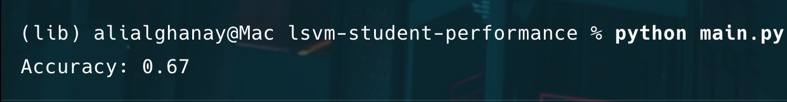

**Project**

- **Description:** This small project trains a linear SVM (LinearSVC) to predict whether a student passed the math exam (threshold: >= 70) using the provided `StudentsPerformance.csv` dataset.

**Files**

- `main.py`: main script that loads data, preprocesses it, trains a `LinearSVC`, and prints accuracy.
- `StudentsPerformance.csv`: CSV dataset (must be in the same directory as `main.py`).
- `requirements.txt`: Python dependencies used for this project.

**Requirements**

- **Python:** 3.11+ recommended (project virtualenv in `lib/` uses 3.13 in this workspace).
- **Install deps:** Uses `pip` and `requirements.txt`.

**Setup**

- Create a virtual environment and install dependencies (macOS zsh):

```bash
python -m venv .venv
source .venv/bin/activate
pip install -r requirements.txt
```

**Usage**

- Ensure `StudentsPerformance.csv` is next to `main.py` and run:

```bash
python main.py
```

The script will print an accuracy score for the model on a held-out test set (for example: `Accuracy: 0.67`).

**How It Works**

- **Load data:** `pandas.read_csv('StudentsPerformance.csv')`.
- **Target:** A new binary column `math_pass` is created from `math score` using `>= 70` as pass threshold.
- **Encode categoricals:** `LabelEncoder` is applied to each categorical column in-place: `gender`, `race/ethnicity`, `parental level of education`, `lunch`, `test preparation course`.
  - Note: `LabelEncoder` assigns integer labels; for non-ordinal categories, consider `OneHotEncoder` instead.
- **Features / Labels:** Features `X` are all columns except the three raw score columns and `math_pass`. Label `y` is `math_pass`.
- **Train/test split:** `train_test_split(..., test_size=0.2, random_state=42)`.
- **Scaling:** `StandardScaler` is fitted on the training features and applied to both train and test sets. Scaling is important for SVMs.
- **Model:** `LinearSVC()` is trained on the scaled features.
- **Evaluation:** Predictions on the test set are compared with `accuracy_score` and printed.

**Notes & Improvements**

- **Categorical encoding:** Replace `LabelEncoder` with `OneHotEncoder` or `pd.get_dummies()` for nominal categories to avoid implying ordinal relationships.
- **Hyperparameters:** `LinearSVC` has parameters such as `C` and `max_iter` — tune with `GridSearchCV` for better performance.
- **Reproducibility:** Set `random_state` where applicable (model and any shuffled processes) for deterministic runs.
- **Class imbalance:** If classes are imbalanced, consider `class_weight='balanced'` or resampling.
- **Metrics:** Accuracy is a simple metric — also report precision, recall, F1-score, and confusion matrix for deeper insight.

**Where to go next**

- Try cross-validation and hyperparameter tuning.
- Try different encoders and feature engineering (e.g., combine reading/writing scores).

If you'd like, I can update `main.py` to use `OneHotEncoder`, add evaluation metrics, or include a script to run experiments and save results.

**Results**


**Note**
This is auto-generated code that requires review and testing.
sorry, i didn't have time to write it myself.
